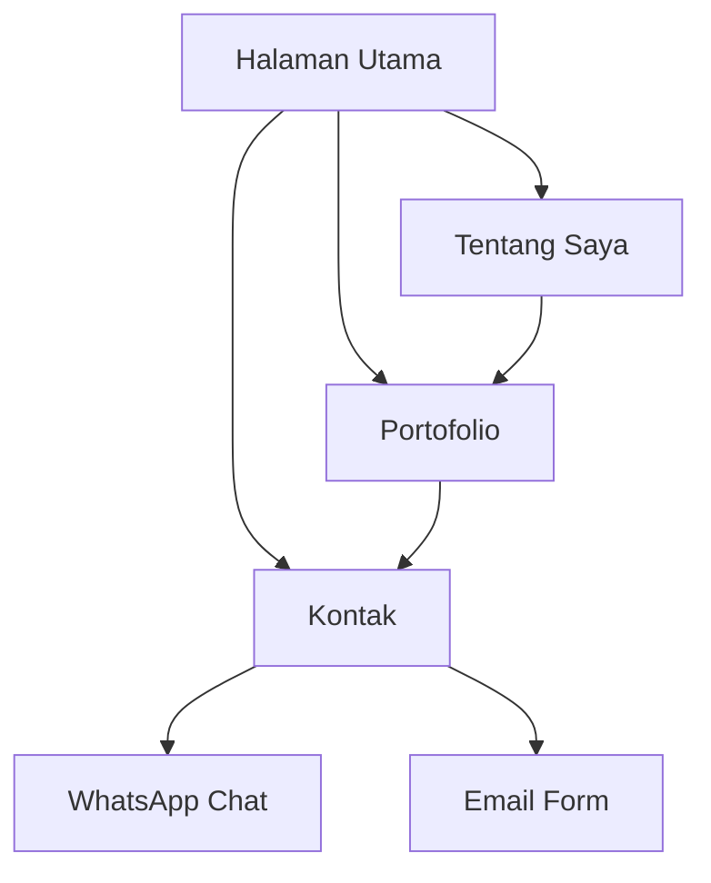

# Dokumen Persyaratan Produk - Website Portofolio Rachmad Rofik

## 1. Gambaran Produk
Website portofolio profesional untuk Rachmad Rofik yang memamerkan keahlian dalam AI terbaru, MetaQuotes MT5, pengembangan aplikasi web, cloud computing, dan teknologi digital modern. Desain yang memukau dan kreatif untuk menarik klien potensial.

Target pasar: Klien yang membutuhkan jasa pengembangan AI, trading bot, aplikasi web, dan solusi cloud computing di Indonesia dan internasional.

## 2. Fitur Utama

### 2.1 Modul Halaman
Website ini terdiri dari halaman-halaman berikut:
1. **Halaman Utama**: Hero section dengan animasi, navigasi modern, dan showcase skills
2. **Tentang Saya**: Profil lengkap, pengalaman, dan keahlian teknis
3. **Portofolio**: Galeri proyek dengan filter kategori dan detail interaktif
4. **Kontak**: Form kontak, informasi WhatsApp, dan lokasi Gresik

### 2.2 Detail Halaman
| Nama Halaman | Modul | Deskripsi Fitur |
|--------------|--------|-----------------|
| Halaman Utama | Hero Section | Tampilkan animasi 3D/parallax dengan nama dan title, efek particle background, call-to-action button |
| Halaman Utama | Skills Showcase | Grid animasi skill cards dengan hover effects untuk AI, MT5, Web Dev, Cloud |
| Halaman Utama | Navigation | Sticky navigation dengan smooth scroll, active state indicator, mobile hamburger menu |
| Tentang Saya | Profile Card | Foto profesional, nama, lokasi Gresik, status available for hire |
| Tentang Saya | Experience Timeline | Timeline visual pengalaman kerja dengan animasi scroll trigger |
| Tentang Saya | Skills Meter | Progress bars animasi untuk level keahlian tiap teknologi |
| Portofolio | Filter Categories | Button filter untuk AI, MT5, Web Apps, Cloud Projects |
| Portofolio | Project Cards | Card layout dengan thumbnail, judul, tech stack, link demo/github |
| Portofolio | Project Modal | Popup detail dengan image gallery, deskripsi lengkap, tech used |
| Kontak | Contact Form | Form dengan validasi untuk nama, email, pesan, dengan loading state |
| Kontak | WhatsApp CTA | Button klik langsung WhatsApp dengan pre-filled message |
| Kontak | Location Map | Embed Google Maps lokasi Gresik, Indonesia |

## 3. Alur Pengguna
Pengguna mengunjungi website → Melihat hero section yang memukau → Scroll untuk melihat skills showcase → Klik navigation untuk eksplorasi → Melihat portofolio projects → Melakukan kontak via form atau WhatsApp.

## 4. Desain Antarmuka

### 4.1 Gaya Desain
- **Warna Utama**: Gradient biru ungu (#667eea → #764ba2) untuk modern tech feel
- **Warna Sekunder**: Abu-abu gelap (#1a1a2e) dengan aksen cyan (#00d4ff)
- **Style Button**: 3D glassmorphism dengan hover glow effect
- **Font**: Poppins untuk heading, Inter untuk body text
- **Layout**: Card-based dengan grid system responsif
- **Ikon**: 3D animated icons menggunakan Three.js untuk wow factor

### 4.2 Detail Desain Halaman
| Halaman | Modul | Elemen UI |
|---------|--------|-----------|
| Halaman Utama | Hero | Three.js particle system, animated gradient background, glitch text effect pada nama |
| Halaman Utama | Skills | Card flip animation on hover, progress ring indicators, tech logos 3D rotate |
| Portofolio | Project Card | Glassmorphism card, hover zoom effect, tech stack pills dengan warna kategori |
| Kontak | Form | Floating labels, input glow focus state, submit button dengan loading spinner |

### 4.3 Responsivitas
Desktop-first design dengan breakpoint:
- Desktop: 1920px, 1440px, 1024px
- Tablet: 768px dengan layout kolom 2
- Mobile: 375px dengan single column layout
- Touch optimization untuk semua interactive elements

### 4.4 Animasi & Interaktivitas
- Scroll-triggered animations menggunakan GSAP
- Smooth scrolling antara sections
- Parallax effect pada hero section
- Micro-interactions pada buttons dan cards
- Preloader dengan custom animation saat pertama kali load