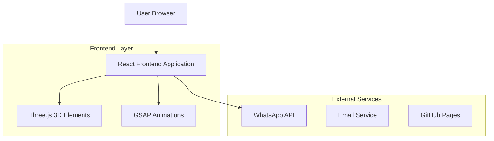

# Dokumen Arsitektur Teknis - Website Portofolio Rachmad Rofik

## 1. Desain Arsitektur


## 2. Deskripsi Teknologi
- **Frontend**: React@18 + Vite + TypeScript
- **Styling**: TailwindCSS@3 + Framer Motion
- **3D Graphics**: Three.js + @react-three/fiber + @react-three/drei
- **Animasi**: GSAP + Framer Motion
- **Build Tool**: Vite
- **Deployment**: GitHub Pages
- **Initialization Tool**: vite-init

## 3. Definisi Route
| Route | Tujuan |
|-------|---------|
| / | Halaman utama dengan hero section dan skills showcase |
| /about | Halaman tentang dengan profile dan experience timeline |
| /portfolio | Halaman portofolio dengan project gallery |
| /contact | Halaman kontak dengan form dan WhatsApp integration |

## 4. Struktur Komponen
### 4.1 Komponen Utama
```typescript
// Core Components
interface Project {
  id: string;
  title: string;
  category: 'AI' | 'MT5' | 'Web' | 'Cloud';
  description: string;
  techStack: string[];
  imageUrl: string;
  demoUrl?: string;
  githubUrl?: string;
}

interface Skill {
  name: string;
  level: number;
  category: string;
  icon: string;
}

interface ContactForm {
  name: string;
  email: string;
  message: string;
}
```

## 5. Konfigurasi Build
### 5.1 Vite Configuration
```typescript
// vite.config.ts
export default defineConfig({
  base: '/portofolio-ai/',
  build: {
    outDir: 'dist',
    assetsDir: 'assets',
    sourcemap: true,
    rollupOptions: {
      output: {
        manualChunks: {
          three: ['three', '@react-three/fiber', '@react-three/drei'],
          animations: ['gsap', 'framer-motion'],
        }
      }
    }
  }
})
```

### 5.2 GitHub Pages Deployment
```yaml
# .github/workflows/deploy.yml
name: Deploy to GitHub Pages
on:
  push:
    branches: [ main ]
jobs:
  deploy:
    runs-on: ubuntu-latest
    steps:
    - uses: actions/checkout@v3
    - uses: actions/setup-node@v3
      with:
        node-version: '18'
    - run: npm ci
    - run: npm run build
    - uses: peaceiris/actions-gh-pages@v3
      with:
        github_token: ${{ secrets.GITHUB_TOKEN }}
        publish_dir: ./dist
```

## 6. Optimasi Performance
### 6.1 Code Splitting
- Lazy loading untuk route components
- Dynamic imports untuk Three.js modules
- Image optimization dengan WebP format

### 6.2 Bundle Size Management
```typescript
// Dynamic imports untuk 3D libraries
const ThreeScene = lazy(() => import('./components/ThreeScene'));
const ParticleSystem = lazy(() => import('./components/ParticleSystem'));
```

## 7. SEO & Meta Tags
```typescript
// Meta configuration
const metaTags = {
  title: "Rachmad Rofik - AI & Digital Technology Expert",
  description: "Expert dalam AI, MetaQuotes MT5, Web Development, dan Cloud Computing berbasis di Gresik, Indonesia",
  keywords: "AI developer, MT5 programmer, web developer, cloud engineer, Gresik Indonesia",
  author: "Rachmad Rofik",
  viewport: "width=device-width, initial-scale=1.0"
};
```

## 8. Environment Variables
```bash
# .env
VITE_WHATSAPP_NUMBER=+6285179910389
VITE_WHATSAPP_MESSAGE=Halo Rachmad Rofik saya mau pesan layanan Anda
VITE_LOCATION=Gresik, Indonesia
VITE_GITHUB_USERNAME=rachmadrofik
```

## 9. Dependencies Utama
```json
{
  "dependencies": {
    "react": "^18.2.0",
    "react-dom": "^18.2.0",
    "three": "^0.158.0",
    "@react-three/fiber": "^8.15.0",
    "@react-three/drei": "^9.88.0",
    "gsap": "^3.12.0",
    "framer-motion": "^10.16.0",
    "react-router-dom": "^6.18.0",
    "lucide-react": "^0.290.0"
  },
  "devDependencies": {
    "@types/react": "^18.2.0",
    "@types/three": "^0.158.0",
    "@vitejs/plugin-react": "^4.1.0",
    "autoprefixer": "^10.4.0",
    "postcss": "^8.4.0",
    "tailwindcss": "^3.3.0",
    "typescript": "^5.2.0",
    "vite": "^4.5.0"
  }
}
```

## 10. Testing Strategy
- Unit testing dengan Vitest untuk utility functions
- Component testing dengan React Testing Library
- E2E testing dengan Playwright untuk critical user flows
- Performance testing dengan Lighthouse CI